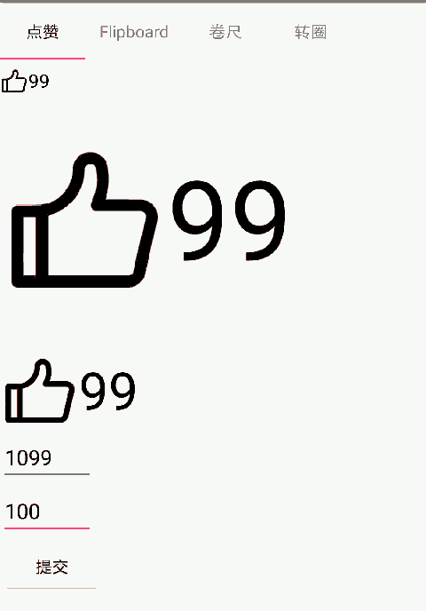
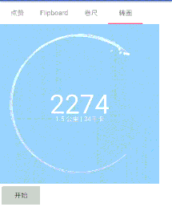

HenCoder 练习项目集合
===

### 说明
扔物线持续更新的给高级安卓工程师的进阶手册里有一些练习题  
这个工程是 [HenCoder](http://hencoder.com/) 的所有配套练习项目。

目前包括  
1、 [HenCoder Android 开发进阶：UI 1-1 绘制基础 ](https://hencoder.com/ui-1-1)    [github链接](https://github.com/hencoder/PracticeDraw1)  
2、 [HenCoder Android 开发进阶：UI 1-2 Paint 详解](http://hencoder.com/ui-1-2)    [github链接](https://github.com/hencoder/PracticeDraw2)  
3、 [HenCoder Android 开发进阶：UI 1-3 文字的绘制](http://hencoder.com/ui-1-3)    [github链接](https://github.com/hencoder/PracticeDraw3)  
4、 [HenCoder Android 开发进阶：UI 1-4 绘制的辅助](http://hencoder.com/ui-1-4)    [github链接](https://github.com/hencoder/PracticeDraw4)  
5、 [HenCoder Android 开发进阶：UI 1-5 绘制顺序](http://hencoder.com/ui-1-5)    [github链接](https://github.com/hencoder/PracticeDraw5)  
6、 [HenCoder Android 开发进阶：UI 1-6 属性动画（上手篇）](http://hencoder.com/ui-1-6)    [github链接](https://github.com/hencoder/PracticeDraw6)  
7、 [HenCoder Android 开发进阶：UI 1-7 属性动画（进阶篇）](http://hencoder.com/ui-1-7)    [github链接](https://github.com/hencoder/PracticeDraw7)  
8、 [HenCoder 仿写酷界面](http://hencoder.com/activity-mock-1/)  

里面每一个我都已经做好了，仅供参考，也欢迎大家指出问题。  
仿写酷界面的预览如下：  
1、即刻的点赞效果：  
  
2、薄荷健康的滑动卷尺效果：  
  
3、小米运动首页顶部的运动记录界面  
  
4、Flipboard 红板报的翻页效果  
  
